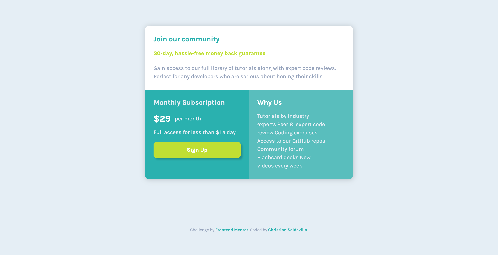

# Frontend Mentor - Single price grid component solution

This is a solution to the [Single price grid component challenge on Frontend Mentor](https://www.frontendmentor.io/challenges/single-price-grid-component-5ce41129d0ff452fec5abbbc). Frontend Mentor challenges help you improve your coding skills by building realistic projects. 

## Table of contents

- [Overview](#overview)
  - [The challenge](#the-challenge)
  - [Screenshot](#screenshot)
  - [Links](#links)
- [My process](#my-process)
  - [Built with](#built-with)
- [Author](#author)

## Overview

### The challenge

Users should be able to:

- View the optimal layout for the component depending on their device's screen size
- See a hover state on desktop for the Sign Up call-to-action

### Screenshot

### Links

- Solution URL: [github.com/soldochris/single-price-grid](https://github.com/soldochris/single-price-grid)
- Live Site URL: [soldochris.github.io/single-price-grid](https://soldochris.github.io/single-price-grid/)

## My process

### Built with

- Semantic HTML5 markup
- CSS custom properties
- Flexbox
- CSS Grid
- Mobile-first workflow

## Author

- Website - [christiansoldevilla.tech](https://christiansoldevilla.tech)
- Frontend Mentor - [@soldochris](https://www.frontendmentor.io/profile/soldochris)
- LinkedIn - [/christian-soldevilla](https://www.linkedin.com/in/christian-soldevilla/)

